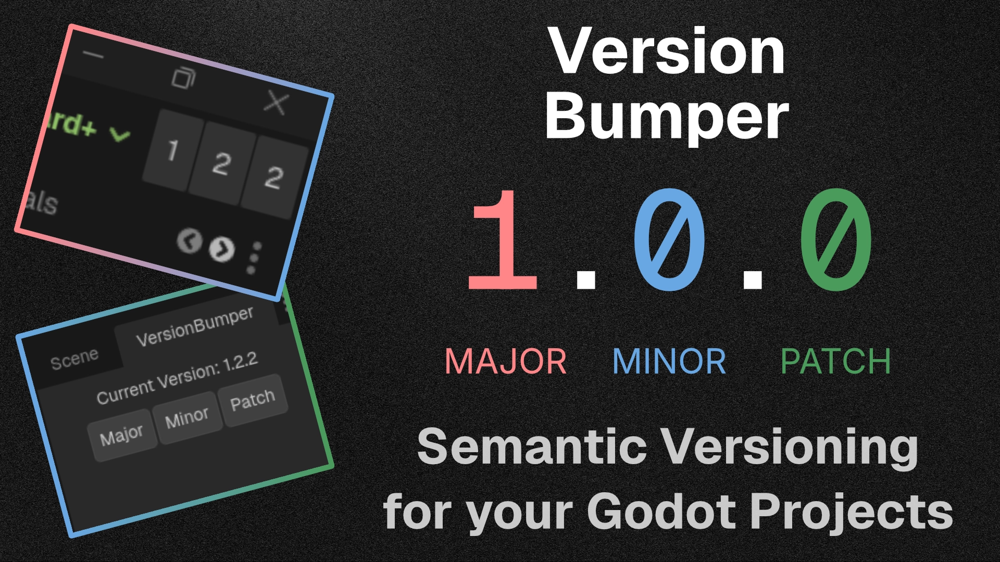

A lightweight, minimalist workflow addon for Godot 4 that takes the friction out of keeping your project's version numbers up to date. It allows you to increment your project's Semantic Versioning (SemVer) with a single click directly from the editor UI.

Whenever you bump a version, the addon automatically updates the `application/config/version` property in your `project.godot` file, ensuring your exported builds always have the correct version string.

## Features

* **One-Click SemVer:** Instantly increment Major, Minor, or Patch (Bug) version numbers.
* **Automatic Project Syncing:** Reads and writes directly to Godot's built-in `application/config/version` project setting.
* **Multiple Display Modes:** Choose the UI layout that fits your workflow best:
  * **Dock Mode:** A standard editor dock panel displaying the current version and three clearly labeled buttons.
  * **Embed Top:** A hyper-minimalist, zero-padding UI injected directly into Godot's top toolbar. It uses minimal screen real estate while keeping your version numbers visible at all times.
* **Zero Clutter:** Designed with Godot's native UI themes in mind to feel seamlessly integrated.

## Installation

1. Download the addon and extract the `version_bumper` folder into your project's `res://addons/` directory.
2. Open your project in the Godot Editor.
3. Go to **Project > Project Settings > Plugins**.
4. Find **Version Bumper** in the list and check the **Enable** box.

## Usage

Once enabled, the Version Bumper will appear in the top-right dock by default. 

To change how the addon is displayed:
1. Look at the very top menu bar of the Godot Editor.
2. Navigate to **Project > Tools > VersionBumper**.
3. Select your preferred display mode:
   * **Dock:** Places the tracker in the standard dock layout.
   * **Embed Top:** Places ultra-compact buttons directly into the top editor toolbar.

Simply click the **Major**, **Minor**, or **Patch** buttons to instantly increment your project's version!
